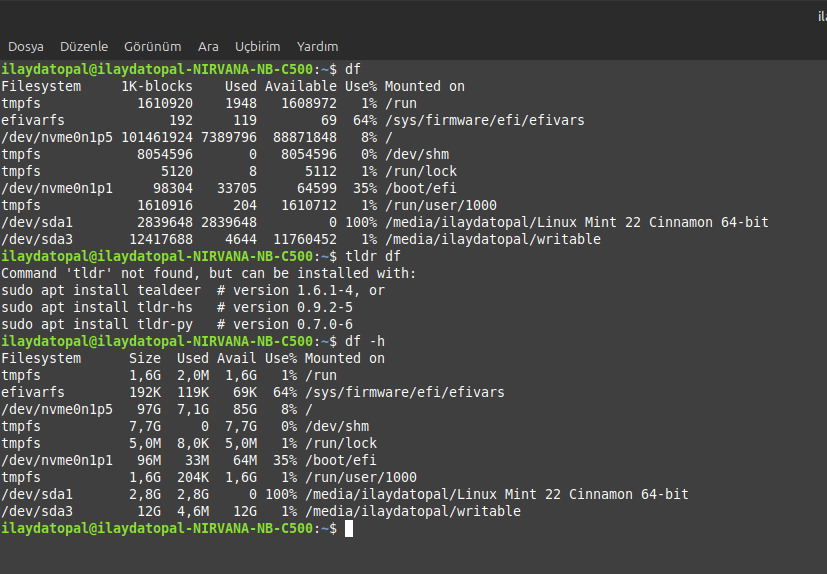

 > ```bash
 
 # <h1 style ="color: BLACK ;">WİNDOWS KOMUT İSTEMİ NEDİR ? 
<span style="color:black;">*Mevcut windows sistemleri,yönetim görevleri için bir CLI olan ve metin tabanlı kullanıcı arayüzünde girilen komuta göre çalışan komut istemini sunar.Komut istemi,yönetim veya sorun giderme komutlarını yürütmek, tekrarllayan görevleri otomatikleştirmek, betik gruplarını çalıştırmak ve işlemleri kapatmak için kullanılan bir uygulamadır (program).*
 # <h1 style ="color: #2463f3 ;">***color help***
 <span style="color:silver;">*Color komutunun nasıl kullanılacağını açıklayan bir yardım metni sunar.*
 ***
 # <h1 style ="color: #2463f3;"> ***color 9***
 <span style="color:silver;">*Bu komut, komut satırının metin ve arka plan renklerini değiştirmek için kullanılır.Color XY şeklinde yazıldığında x arka plan rengini y ise metin rengini ifade eder.Örneğin color 9  metin rengini mavi yapar.*<br></span>

 
 ***

 # <h1 style ="color: #2463f3 ;"> ***hostname***
 <span style="color:silver;">*Bilgisayarın ağ üzerinde kendisini tanımlayan host adını görüntülemek veya değiştirmek için kullanılır.genellikle ağ ayarlarını yapılandıran kiişiler veya sistem yöneticileri tarafından kullanılır.*<br></span>

 
 ***

 # <h1 style ="color: #2463f3 ;">***date*** 
 # <h1 style ="color: #2463f3 ;"> ***time***
 <span style="color:silver;">*Time komutu sistem saatini gösterir.Date komutu da sistemdeki geçerli tarihi görüntüler.*<br></span>

 
 ***

 # <h1 style ="color: #2463f3 ;">***cd*** 
 <span style="color:silver;">*cd komutu,en temel komutlardandır ve kullanıcıların dizinler arsında geçiş yapmasını sağlar.*
 # <h1 style ="color: #2463f3 ;">***cd..***
 <span style="color:silver;">*.. sembolü "bir üst dizin" anlamına gelir ve bulunduğumuz dizinden üst seviyeye geçiş yapmayı sağlar.*
 # <h1 style ="color: #2463f3 ;">***cd.***
 <span style="color:silver;">*Geçerli dizine tekrar gitmek için kullanılır.</span>*<br>

 
 ***
 
 # <h1 style ="color: #2463f3;">***netsh*** 
 <span style="color:silver;">*Ağ yapılandırmalarını yönetmek için kullanılır.<br>
 netsh>wlan show profile=Bilgisayardaki tüm ağ arayüzlerini ve durumları listeler.<br>
netsh> wlan show profile key=clear=Daha önce bağlanılan bir Wİ-Fİ ağının şifresini gösterir.*<br></span>


***

# <h1 style ="color: #2463f3 ;">***mkdir ->  Yeniklasör***
<span style="color:silver;">*Kullanıcıların yeni klasör oluşturmasını sağlar.Aynı anda birçok klasör oluşturabilir.*<br></span>


***

# <h1 style ="color: #2463f3 ;">***rmdir -> Yeniklasör***
<span style="color:silver;">*Boş klasörleri silmek için kullanılır.Eğer klasörün içinde dosya yada alt dizin varsa rmdir komutu çalışmaz ve hata verir.*<br></span>


***

# <h1 style ="color: #2463f3 ;">***type nul ->  Dosya***
<span style="color:silver;">*Bu komut belirtilen dosya adında boş bir dosya oluşturur.Eğer dosya zaten var ise içeriğini siler ve boş olmasını sağlar.*<br></span>


***

# <h1 style ="color: #2463f3 ;"> ***del***
<span style="color:silver;">*Dosya silmek için kullanılır.Bu komut belirtilen dosyayı siler ve geri dönüşüm kutusuna göndermez,kalıcı olarak siler.Sadece dosya siler klasör silmez.*<br></span>


***

# <h1 style ="color: #2463f3 ;"> ***copy ->  Dosya Yeniklasör/Dosya2***
<span style="color:silver;">*Belirtilen kaynak dosyayı belirttiğimiz hedef dosyaya kopyalamaya yarayan komuttur.Klasör kopyalamak için uygun değildir ancak dosyaları belirli bir klasöre kopyalayabiliriz.*<br></span>


***

# <h1 style ="color: #2463f3 ;"> ***move -> Dosya/Yeniklasör***
<span style="color:silver;">*Bu komut, kaynak dosya veya klasörü hedef konuma taşır.Kopyalamaz,taşır.*<br></span>


***

# <h1 style ="color: #2463f3 ;"> ***ren*** 
<span style="color:silver;">*Dosyaların yada klasörlerin eski adını yeni adla değiştirmeye yarayan komuttur.Konumu değiştirmez,sadece adını değiştirir.*<br></span>


***

# <h1 style ="color: #2463f3 ;"> ***ping***</h1>
<span style="color:silver;">*Ağ bağlantısını test etmek için kullanılır.Bir cihazın başka bir cihazla iletişim kurup kurmadığını kontrol eder.Cihazın IP adresine veya alan adına küçük veri paketleri gönderir ve bu paketlerin geri dönüp dönmediğini, geri dönüş süresini ölçer.*<br>
Örneğin ping google.com = Bu komut,google.com adresine ping gönderir ve yanıt süresini ölçer.<br></span>


***

# <h1 style ="color: #2463f3 ;"> ***dir***
<span style="color:silver;">*Bir dizindeki dosya ve klasörlerin listesini gösterir.Belirtilen dizindeki alt klasörleri,dosyaları ve bunların boyut,oluşturma tarihivb. özelliklerini görüntüler.<br>  (DIR) bulunuyorsa klasör bulunmuyorsa dosya.*<br></span>


***

# <h1 style ="color: #2463f3 ;">***ipconfig***
<span style="color:silver;">*Ağ yapılandırmasını görüntülemek ve ağ bağlantısıyla ilgili ayarları değiştirmek için kullanılır.Bilgisayarın alt ağ maskesini,IP adresini,varsayılan ağ geçidini,DNS sunucularını ve diğer bağlantı bilgilerini sunar.*<br></span>

 
***

# <h1 style ="color: #2463f3 ;"> ***echo***
<span style="color:silver;">*Metin çıktısı üretmek komut dosyaları yazarken bilgi mesajları göstermek ya da değişken değeri görüntülemek için kullanılan komuttur.<br>Örneğin echo deneme Dosya = deneme yazısını Dosya isimli dosyaya yazar.*<br></span>


***

# <h1 style ="color: #2463f3 ;"> ***mode***
<span style="color:silver;">*Bu komut ekran,yazılar,seri portlar gibi aygıtların yapılandırmasını gösterir veya değiştirir.Ekkran çözünürlüğünü,satır sütun sayısını değiştirebiiriz bu komut ile.*<br></span>


***

# <h1 style ="color: #2463f3 ;">***tasklist***
<span style="color:silver;">*Sistemde çalışan tüm işlemleri listeleyen komuttur.Bu komutla aktif olan programlar ve sistem süreçleriiyle ilgili bilgi alınılır.*<br></span>


***

# <h1 style ="color: #2463f3 ;"> ***shutdown***
<span style="color:silver;">*Bilgisayarın kapanması yada yeniden başlatılması için kullanılan komuttur.Ayrıca kapanma süresini ayarlamak da mümkündür.*<br></span>


***

# <h1 style ="color: #2463f3 ;"> ***diskpart*** 
<span style="color:silver;">*Disk yönetimi için kullanılır.Diskleri bölümlendirme, biçimlendirme veya yapılandırma işlemlerini gerçekleştirmek için kullanılır.*<br></span>


# <h1 style ="color: black ;">LİNUX KONSOL KOMUTLARI ?
<span style="color:black;">*Terminal veya komut satırı aracılığıyla linux işletim sisteminde işlemleri gerçeklestirmek için kullanılan talimatlardır.Bu komutlar, sistem yönetimi, dosya işlemleri, ağ yapılandırması ve daha birçok işlevi hızlı bir şekilde yapmaya yarar.*
# <h1 style ="color: maroon ;">***cd***
*Linuxda kullanıcının bbulunduğu dizini değiştirmek için kullanılır.bu dosya sistemi içinde gezinmeyi sağlar.<br>Temel kullanımı;*
*         cd [dizin adı]
*Belirtilen dizine geçiş yapar.*
*         cd
*Hiçbir argüman verilmezse,kullanıcının ana dizinine gider.*
*         cd..
*Bir üst dizine geçer.*
*         cd -
*Önceki bulunduğunuz dizine döner.*


***

# <h1 style ="color: maroon ;">***du***
*Linux'ta du komutu,dosya ve dizinlerin disk üzerinde ne kadar yer kapladığını gösterir.Disk kullanımı hakkında bilgi verirken özellikle belirli bir dizindeki öğelerin boyutlarını öğrenmek için kullanılır.<br>Örneğin du -c -h komutunda, -c (total) tüm dizinler ve dosyalar için ayrı ayrı boyutları listeler ve sonunda toplam bir değer ekler.-h (Human-readable), çıkışı insan tarafından okunabilir biçimde KB,MB,GB gibi birimlerle gösterir.* 


***

#  <h1 style ="color: maroon ;">***df***
*Disk free komutu,disk bölümlerinin mevcut kullanım durumunu ve boş alan miktarını görüntülemek amacıyla kullanılır.Boş alanın yetersiz olduğu durumları tespit etmek için kullanılır.Varsayılan olarak tüm bağlı dosya sistemlerinin kullanım bilgilerini blok (bytes,kilobytes vb.) biriminde gösterir.*
*          df -h  (KB,MB,GB)
*          tldr df 


***

# <h1 style ="color: maroon ;">***cat***
*Temel kullanımları;*<br>
* Bir dosyanın içeriğini görüntülemek
* Birden fazla dosyanın içeriğini birleştirmek ve görüntülemek
* Bir dosyanın içeriğini başka bir dosyaya yazdırmak
* Bir dosyanın içeriğini başka bir dosyanın sonuna eklemek
* Terminalde yeni dosya oluşturmak


***

#  <h1 style ="color: maroon ;">***chmod***
*Linux'ta chmod komutu, dosya ve klasörlerin erişim izinlerini değiştirmek için kullanılır.Linux tabanlı sistemlerde her dosya ve klasörün üç temel erişim türü (okuma, yazma, çalıştırma) ve bu izinlerin farklı gruplar (kullanıcı) için ayrı ayrı tanımlanabilmesi vardır.chmod, bu erişim izinlerini yönetmenizi sağlar.*
*     r = okuma izni (read) -> Dosya      
*     r = klasörü listeleme izni -> Klasör
*     w = yazma izni (write) -> Dosya
*     w = dosyayı/klasörü değiştirme izni -> Klasör
*     x = çalıştırma izni (execute) -> Dosya
*     x = dizin içine girme izni -> Klasör 
*          chmod [kim] [işlem] [izin] dosyaadı

***

 #  <h1 style ="color: maroon ;">***mkdir*** 
*mkdir komutu,yeni bir klasör oluşturmak için kullanılır.Bu komut belirttiğimiz konumda bir veya daha fazla klasör oluşturmaya yarar.Birden fazla klasör oluştururken klasör adlarını boşluklara ayırarak yazmalıyız.*
*          mkdir klasör1 klasör2 klasör3

***

#  <h1 style ="color: maroon ;">***rmdir***
*Boş klasörleri silmek için kullanılır.Bu komut, belirtilen klasörü yalnızca içi boş olduğunda siler.Eğer içinde dosya yada alt klasör varsa,rmdir komutu hata verir.*
*           rmdir klasöradı


***

#  <h1 style ="color: maroon ;">***touch***
*Bu komut,belirtilen isimde bir dosya oluşturur.Dosya mevcut değilse yeni bir dosya oluşturur.Dosya zaten varsa,dosyanın son erişim ve son değiştirilme zaman bilgilerini gösterir.Dosyanın zaman damgasını günceller fakat içeriğini değiştirmez.* 
*         touch yenidosya.txt

***

#  <h1 style ="color: maroon ;">***rm***
*Bu komut dosya ve klasörleri silmek için kullanılır."remove" kelimesinin kısaltmasıdır.rmdir ile aynı işlemi yapar ancak aralarında işlevsel farklar vardır.rmdir dolu bir klasörü silemezken rm -r komutu dolu klasör içindeki tüm dosya ve alt klasörleri siler.*
*         rm -r klasöradı


***

#  <h1 style ="color: maroon ;">***cp***
*Dosya veya klasörleri kopyalamak için kullaılan bir komuttur.Bu komut,kaynak dosyayı  belirtilen hedef konuma kopyalar.Kaynak dosyayı silmez,sadece kopyasını oluşturur.Klasörleri kopyalarken -r seçeneğini eklemek şarttır,aksi takdirde hata alınır.*
*         cp dosya.txt hedefklasör


***

#  <h1 style ="color: maroon ;">***mv***
*mv komutu,dosya ve klasörleri taşımak için kullanlan temel bir komuttur.Bu işlem sırasında mv, taşınan dosyayı yeniden oluşturmaz yani yeni bir kopya yapmaz.Orijinal dosyanın referansını değiştirir.*
*         mv kaynak hedef

***

#  <h1 style ="color: maroon ;">***echo***
*Linux'ta echo komutu, bir metni veya bir değeri ekrana yazdırmak için kullanılır.Genellikle metni basitçe görüntülemek,değişkenlerin değerlerini yazdırmak ya da bir metni dosyaya veya başka bir komuta yönlendirmek için kullanılır.<br>(>) yönlendirme operatörüdür,metni deneme.txt dosyasının içine yazar.*
*            echo  "merhaba" > deneme.txt

***

#  <h1 style ="color: maroon ;">***ls***
  ls komutu, dosya ve klasörleri listelemek için kullanılan temel komuttur.Bu komut geçerli dizindeki yada belirttiğimiz dizindeki dosya ve klasörlerin adını sıralar.ls komutuyla dosyaların ayrıntılı bilgilerini ve çeşitli özelliklerini de görüntüleyebiliriz.* 
*         ls
*Sadece dosya ve klasör adını gösterir.*


***

#  <h1 style ="color: maroon ;">***clear***
*clear komutu, terminal ekranınında mevcut çıktı ve geçmiş komutları silerek ekranı temizler.Ancak geçmiş komutlar geçerliliğini kaybetmez ve terminal geçmişi kaybolmaz.Bu komut, terminali temiz tutmaya yarar ve düzenli bir çalışma ortamı sağlar.*


***

#  <h1 style ="color: maroon ;">***wget***
*Bu komut, Linux'ta bir dosyayı internet üzerinden indirmek için kullanılan güçlü bir araçtır.Bu araç arka planda çalışabilir ve indirme işlemi tamamlandıktan sonra çıktı vererek işlem bitiminde kullanıcıyı bilgilendirir.*
*        wget https://7-zip.org-linux-x64.tar.xz

***

#  <h1 style ="color: maroon ;">***locate***
*Locate komutu, dosya ve klasörlerin hızlı bir şekilde bulunmasını sağlar.Bu komut,sistemdeki dosya ve klasörlerin bir veritabanını kullanarak belirli bir ad arar ve ilgili dosya yolunu gösterir.find komutuna göre çok daha hızlıdır çünkü daha önce oluşturulmuş bir veritababnını kullanır.*


***

#  <h1 style ="color: maroon ;">***ifconfig***
*Linux'ta ifconfig komutu,ağ arayüzlerinin yapılandırılması, ağ durumu ve IP adreslerini görmeyi sağlar.*


***

#  <h1 style ="color: maroon ;">***history***
*Kullanıcının terminalde çalıştırdığı önceki komutların bir listesini görüntüler.Bu komut, genellikle terminal geçmişini incelemek,tekrar kullanılabilecek komutları görmek veya belirli komutlara hızlıca erişmek için faydalıdır.*
*        history | grep "komutismi"
*Bu komut geçmişteki belirli bir komutun çıktısını verir.*


***

#  <h1 style ="color: maroon ;">***head***
*Bu komut,bir dosyanın veya komut çıktısının başlangıcındaki belirli bir sayıda satırı görüntülemek için kullanılır.Genellikle büyük dosyaların ilk birkaç satırını incelemk için kullanılır.*
*            head -n 5 dosya.txt

***

#  <h1 style ="color: maroon ;">***pwd***
*pwd komutu,"print working directory" ifadesinin kısaltmasıdır.Kullanıcının mevcut çalışma dizinini ekrana yazdırır.Bu komut, dizin yapısını keşfetme ve farklı dizinlere geçiş yapmakta fayda sağlar.* 


***
 


